# camera_dash

A self-hosted, pluggable computer-vision platform for multiple concurrent cameras.

Drives USB UVC, FLIR thermal, Xbox 360 Kinect (depth), IP/RTSP, screen capture, and Luxonis OAK cameras. Arranges live feeds in a browser dashboard with draggable tiles, runs configurable detection pipelines authored in a visual editor (or composed by Claude from a natural-language prompt), and emits classification events over MQTT, Kafka, ntfy, Telegram, email, webhooks, and more.

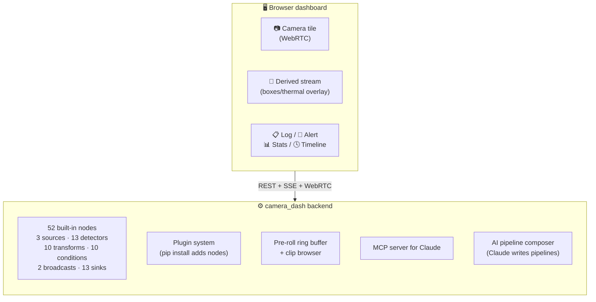

## Quick start

```bash
git clone <repo> camera_dash && cd camera_dash
bash scripts/dev-setup.sh           # auto: macos | linux
./scripts/run.sh all                # backend + frontend + mediamtx
```

Open **http://localhost:5173**.

For details, deploy targets, optional deps, see [`docs/INSTALLATION.md`](docs/INSTALLATION.md).

## Visual tour

Every screenshot below is from a live deploy on a Raspberry Pi 5 with two PureThermal Lepton thermal cameras attached. The same UI runs unchanged on macOS / Linux / DGX with USB webcams, Kinects, RTSP feeds, etc.

### Dashboard — every camera and every pipeline output, in one place

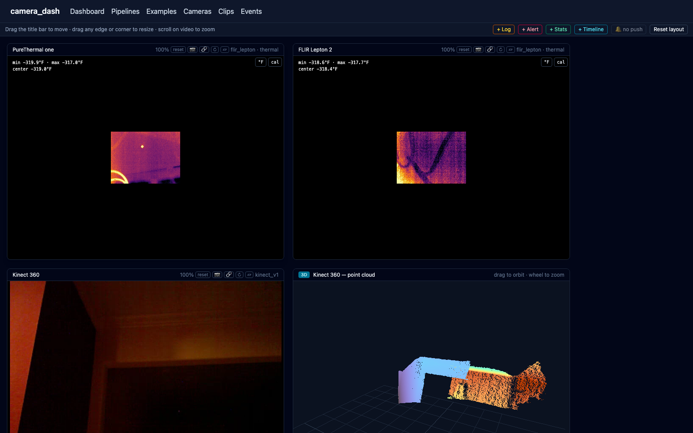

The top row is the raw cameras (here, two FLIR Leptons in radiometric mode — hover to read °F per pixel, drag the title bar to rearrange, scroll to zoom). The bottom row is **derived tiles** produced by running pipelines:

- The violet **derived ↗** badge links to the pipeline that produced the tile.
- The amber **from `flir_0`** chip shows the source camera the pipeline consumes — so you can trace any annotated stream back to its raw source without opening the editor.
- The label (*Motion overlay*, *FLIR + person boxes*) is the pipeline node's `label` config.

### Stream URLs and player commands — one click to copy

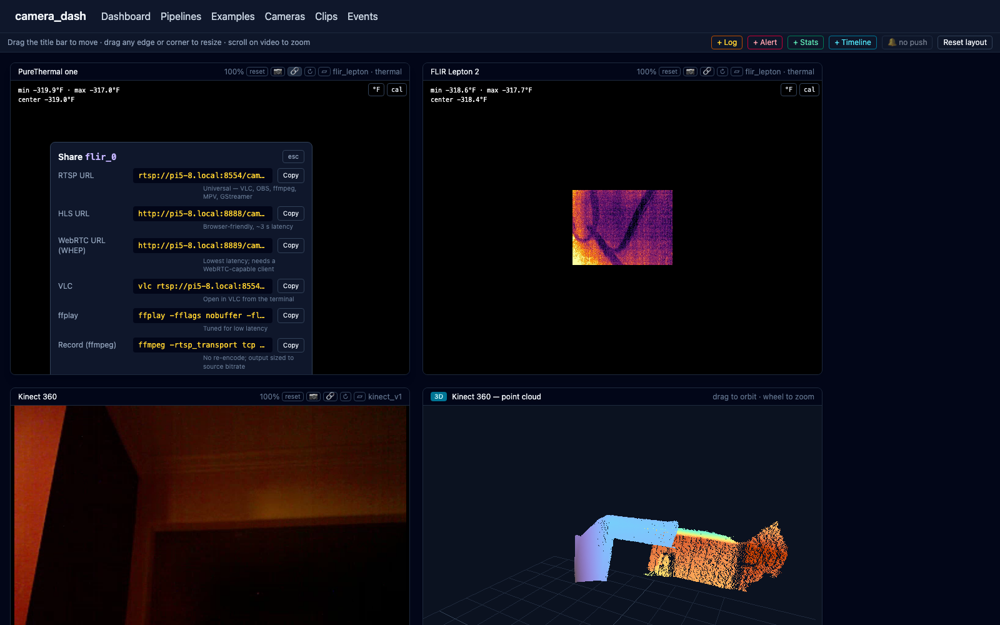

Click the **🔗** button on any tile and get a popover with:

- **RTSP / HLS / WebRTC** URLs (correct hostname auto-derived from the dashboard you're viewing — `pi5-8.local` here, `localhost` on dev).
- Ready-to-paste **VLC**, **ffplay**, **ffmpeg record / snapshot**, and **mpv** command lines with a one-click *Copy* button on each row.

Useful when you want to pull a stream into OBS, save it to disk from cron, or just play it on another laptop.

### Cameras — discover devices, then click to add

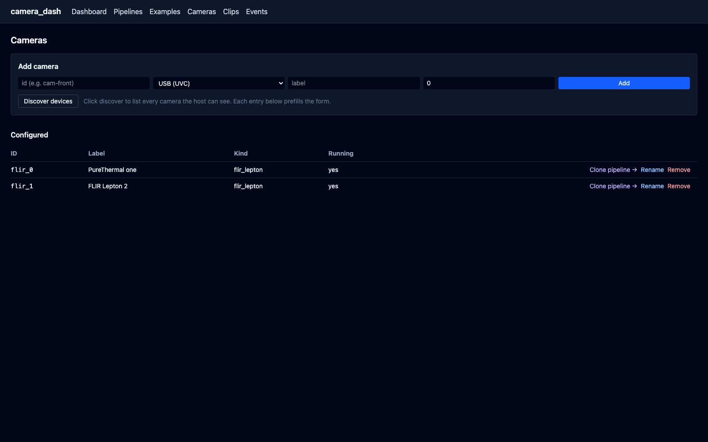
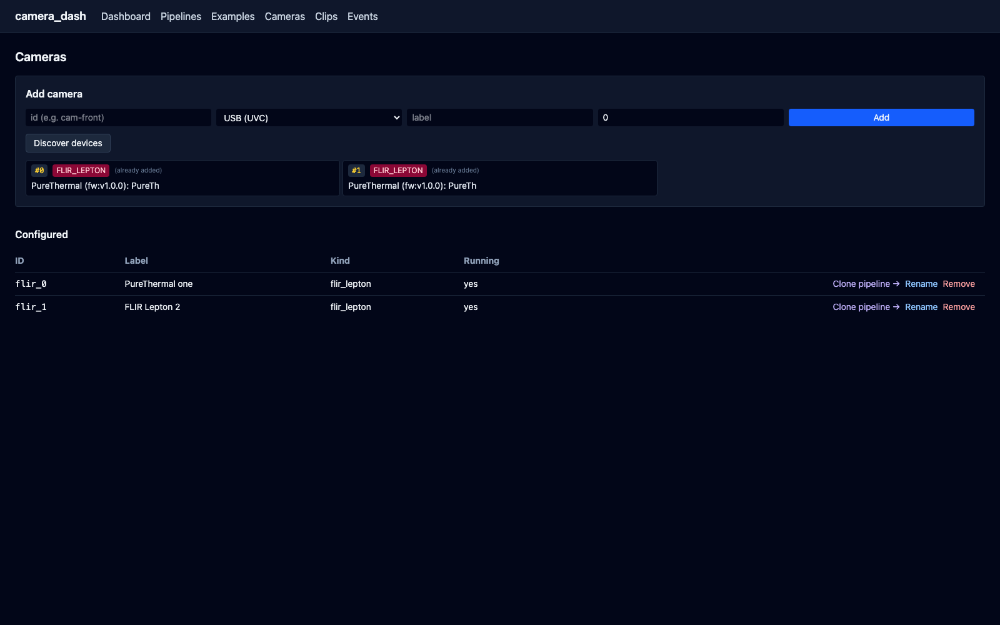

The **Cameras** tab lists what's configured and lets you add more. Click **Discover devices** and every UVC camera, FLIR PureThermal, and Kinect 360 the host can see shows up as a clickable card with its USB device path. Click a card → the **Add camera** form prefills with the right kind (`flir_lepton` / `kinect_v1` / `uvc`) and device pin. Devices you've already added are tagged so you don't accidentally double-add. Each configured camera has a **Clone pipeline →** button to copy any existing pipeline onto this camera in one step.

### Examples — install pipelines you can play with right away

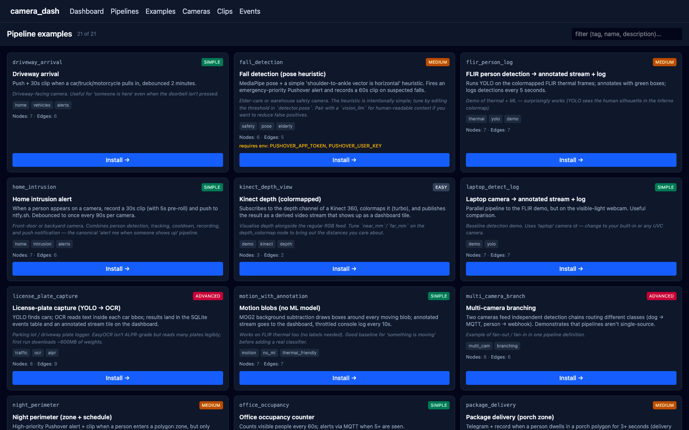

The **Examples** tab is a gallery of working starter pipelines (driveway arrival, fall detection, license-plate capture, motion blobs, FLIR person detection, Kinect depth view, wildlife camera, package delivery, scorpion watch, multi-camera branching, office occupancy, night perimeter…). Each card describes what the pipeline does, what it needs, and what cameras it targets. **Install** clones it into your live pipeline list — substituting your camera IDs for the example's placeholders — ready to **Start** in the editor.

### Editor — a visual graph, with smart defaults

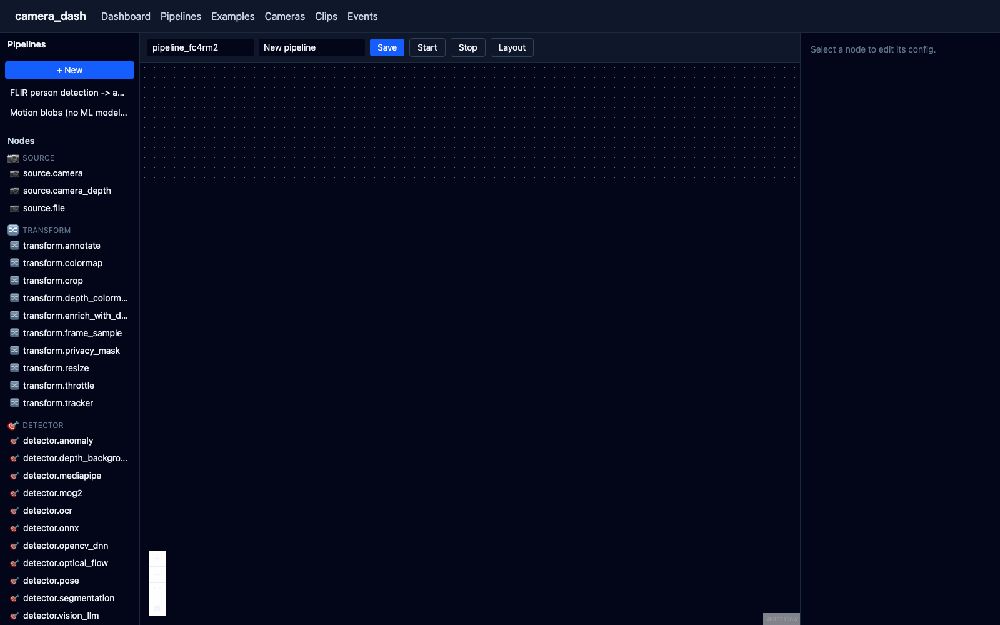

The **Pipelines** tab opens the editor. The left sidebar lists installed pipelines and a categorised palette (📷 source / 🎯 detector / 🔀 transform / ⚖️ condition / 📡 broadcast / 📥 sink, **52 nodes total**). The toolbar across the top has **Save**, **Start**, **Stop**, and **Layout** (auto-arrange the graph into a tidy left-to-right flow). A one-paragraph plain-English description of the current graph sits under the toolbar so you can see what the pipeline does at a glance.

### Editor — a pipeline loaded, ready to tweak

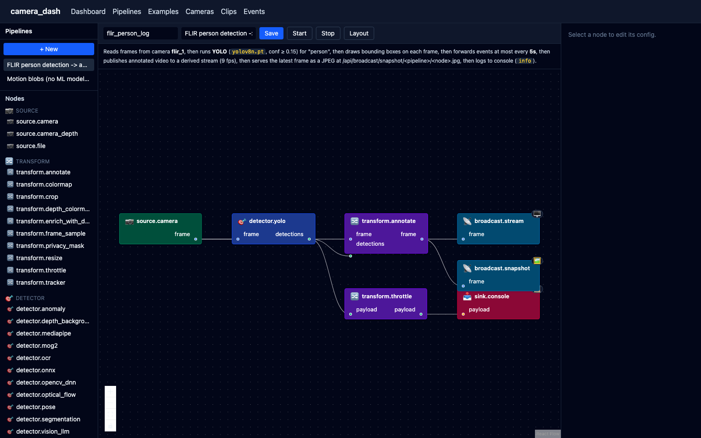

Open any pipeline and the graph renders with category colours. Look at the top-right corner of `broadcast.stream` and `broadcast.snapshot` nodes — the 🖥️/🖼️ glyphs are **dashboard-surface badges**: nodes whose output you can see on the Dashboard tab. Hover any badge for a tooltip explaining exactly what it surfaces (live WebRTC video tile vs. auto-refreshing JPEG endpoint).

### Editor — properties panel with markdown-rendered docs

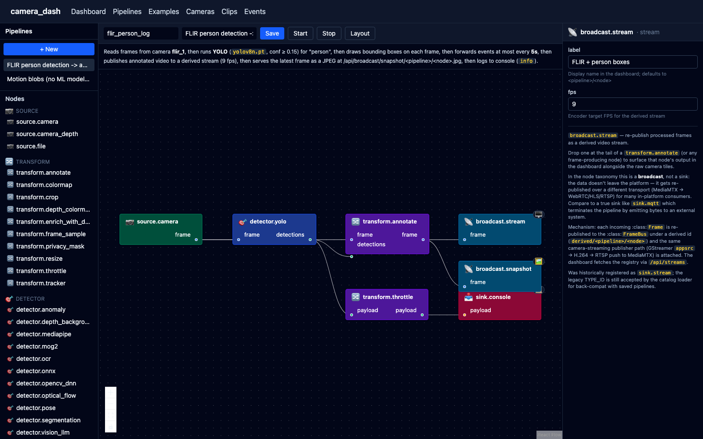

Click any node in the graph to edit its config in the right panel. The form is built from the node's JSON Schema:

- Type-correct widgets — `<select>` for `enum` fields, number inputs with `min`/`max` validation, native checkboxes for booleans, comma-separated text → array conversion for things like YOLO classes.
- **Per-field inline validation** — out-of-range, wrong type, missing-required all flag right under the field as you type.
- **`camera_id` becomes a live dropdown** populated from `/api/cameras` so you pick from real cameras, not free-text. There's still a *Custom value…* escape hatch for pre-staging offline pipelines.
- The node's full Python docstring renders below the form with markdown — paragraphs, lists, `inline code`, **bold**, and `https://` links all formatted properly.

### Editor — hover any palette node for a help card

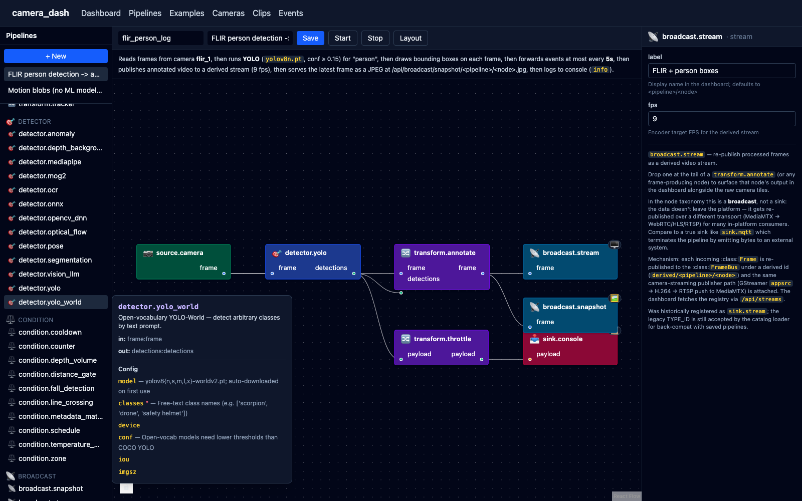

The palette popover spells out: what the node does (markdown-rendered docstring), the input/output ports (port name + type), and every config field with its description and whether it's required. Lets you compose a pipeline without leaving the editor to read the docs.

### Clips — every recorded clip + snapshot in one place

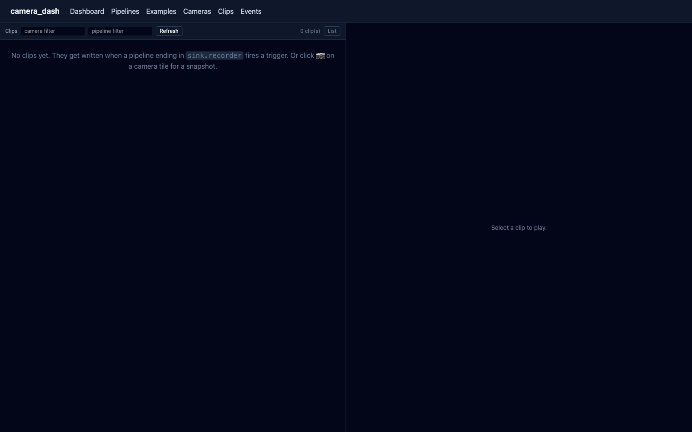

The **Clips** tab is a thumbnail grid of every clip the `sink.recorder` node has written and every snapshot the **📷** button on a tile has captured. Click a thumbnail for inline mp4 playback. Filter by camera or pipeline.

### Events — the live SSE firehose + the persisted log

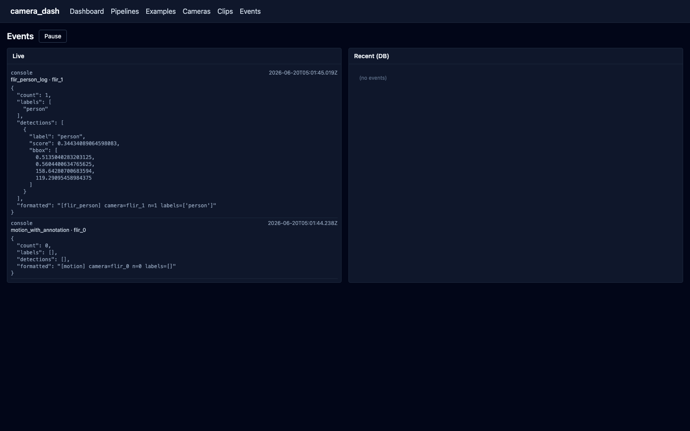

The **Events** tab shows live SSE events on the left (each `sink.console`, `sink.sqlite`, or `condition.*` fire shows up in real time) and a queryable history of events the platform has persisted on the right. Every event includes the source pipeline + camera + the full JSON payload, so you can debug a pipeline by watching what it's actually emitting.

### 3D point cloud — Kinect depth, rendered live in the browser

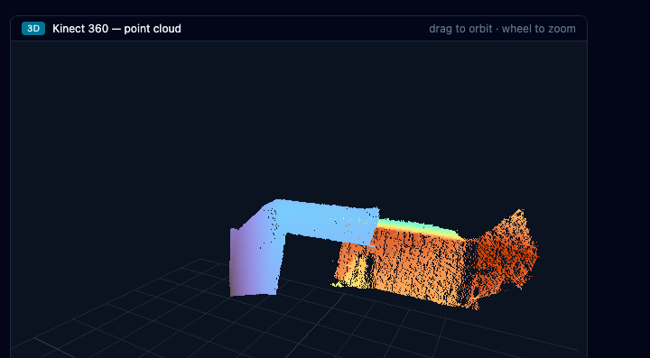

Drop a **3D** tile next to any depth-capable camera (Kinect v1/v2, OAK-D, RealSense). Three.js back-projects the uint16 mm depth matrix through pinhole intrinsics into XYZ, paints with a turbo palette (warm near, cool far), and gives you orbit (drag) + zoom (wheel) — all in the browser, no plugin. Auto-stretches the colour range every frame so a 1–3m scene doesn't look like a flat band.

### Audio pipelines — YAMNet, the same shape as video

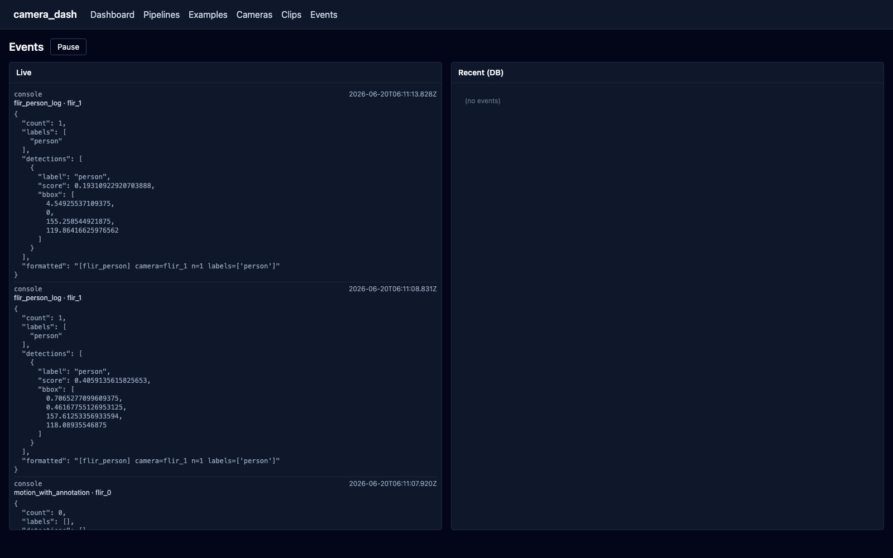

A USB mic is just another source: `source.audio` publishes PCM on the `audio` channel, `detector.audio_class` runs YAMNet (521 AudioSet classes) on rolling 0.96s windows. Detections share the same `Event` shape as video events, so the same SSE stream, SQLite log, alert tile, and notification sink wiring all work — sound and video events show up side-by-side.

### Home Assistant — fire HA services from any pipeline event

`sink.home_assistant` calls the HA REST API. Two modes: full service-call (`light.turn_on` + service data) or the convenience `entity_id` + `action` (`on`/`off`/`toggle`). Per-target cooldown so a chatty trigger doesn't hammer HA. Drop it after any `condition.*` and your existing automations get camera-aware in five minutes.

### Push notifications — install the dashboard as a PWA

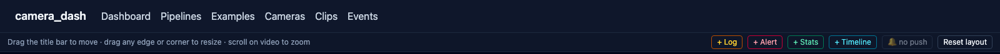

A bell in the dashboard header subscribes the browser to push notifications. Add to home screen on iOS/Android (the manifest makes it installable as a standalone app), enable push, and every `condition.*` match fires a notification to your device — even when the browser is closed. Backend is `pywebpush` with VAPID keys you generate via `camera_dash vapid`; subscriptions persist in SQLite, so phones stay subscribed across backend restarts.

## Documentation

| Document | What's in it |
|---|---|
| [USER_MANUAL.md](docs/USER_MANUAL.md) | How to use the dashboard, tiles, pipeline editor, AI composer, templates, clip browser. Everything you'd need without ever reading the code. |
| [INSTALLATION.md](docs/INSTALLATION.md) | Per-platform install (macOS, Ubuntu/Debian, Fedora, Arch, Raspberry Pi), GPU notes, Docker, env vars |
| [RASPBERRY_PI.md](docs/RASPBERRY_PI.md) | End-to-end Pi 5 install with systemd auto-start; gotchas + day-to-day ops |
| [ARCHITECTURE.md](docs/ARCHITECTURE.md) | System diagrams, data flow, plugin system, design choices, code layout |
| [NODES.md](docs/NODES.md) | Reference for all 56 built-in nodes with config + ports |
| [API.md](docs/API.md) | REST endpoints, SSE/WebSocket streams, MCP tools |
| [DEVELOPMENT.md](docs/DEVELOPMENT.md) | Writing nodes, plugins, tile types; tests; debugging |
| [TROUBLESHOOTING.md](docs/TROUBLESHOOTING.md) | Common failure modes + fixes (most are real bugs we hit and resolved) |

## What's in the box

**Cameras**: UVC (built-in webcams + USB cameras), FLIR PureThermal + Lepton 3/3.5 (with true radiometric temp-on-hover), Xbox 360 Kinect (v1, RGB + 11-bit depth, requires `libfreenect` — see install), RTSP/IP cameras, desktop screen capture, Luxonis OAK-D/OAK-1 stereo, USB microphones via PortAudio.

**Detection**: YOLOv8/v11, YOLO-World (open-vocab text prompts), **Coral Edge TPU YOLO**, ONNX Runtime, OpenCV DNN, MediaPipe face + pose, MOG2 motion, optical flow, instance segmentation, EasyOCR, background anomaly, depth-background subtraction, **YAMNet audio classification**, and **Claude vision** for rich descriptions.

**Transforms**: resize/crop/colormap/annotate/throttle, frame-rate sampling, depth colormap, depth-enriched detections, ByteTrack tracker, polygon privacy mask, and **cross-camera Re-ID** (CLIP embeddings, shared in-process so the same person keeps their `track_id` across pipelines).

**Conditions**: metadata match (Python expression with safe AST), temperature gate, polygon zone (enter/leave/dwell), object counter, line crossing, time-of-day schedule, cooldown/debounce, depth-distance gate, depth-volume gate, pose-based fall detection.

**Sinks**: MQTT, Kafka, HTTP webhook, **Home Assistant REST**, Telegram, ntfy.sh, Pushover, Slack, SMTP email, console log, JSON-lines, SQLite event log, clip recorder, derived video stream, .ply point-cloud writer.

**Dashboard**: free-positioning tiles (drag + 8-way resize) for live video, annotated derived streams, **3D point-cloud viewer** (Three.js, orbit + zoom), scrollable log tiles, flashing alert tiles with audio, stats tiles with live fps, and timeline tiles showing event ticks. **Installable as a PWA** with push notifications.

**Pipeline editor**: visual React Flow editor + JSON properties panel, **AI composer** (Claude generates a pipeline from a prompt), built-in starter templates.

**Clip browser**: thumbnail grid + inline mp4 player; snapshots and recordings live in the same place.

**REST + MCP**: full management API; MCP server exposes 13 tools to Claude Code / Claude Desktop.

## Stack

Python 3.13 (3.11+ supported) · FastAPI · asyncio · GStreamer · MediaMTX · React 18 · Vite · TypeScript · Tailwind 4 · React Flow · SQLite (or Postgres) · ffmpeg

## License

TBD.
