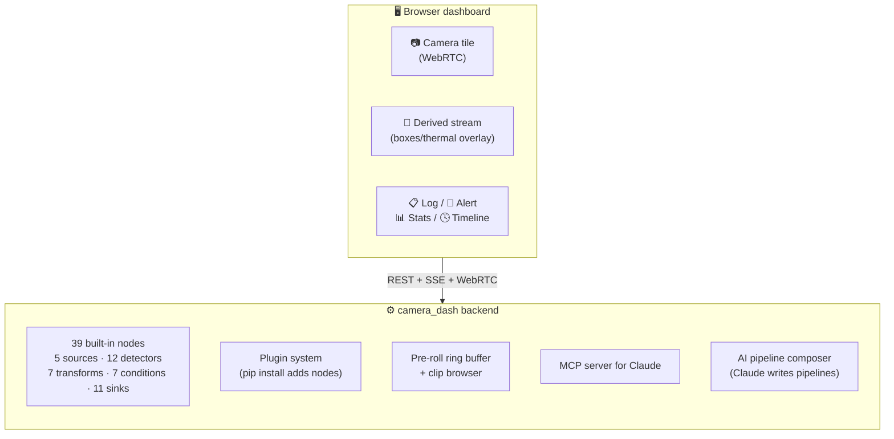

# camera_dash

A self-hosted, pluggable computer-vision platform for multiple concurrent cameras.

Drives USB UVC, FLIR thermal, IP/RTSP, screen capture, and Luxonis OAK cameras. Arranges live feeds in a browser dashboard with draggable tiles, runs configurable detection pipelines authored in a visual editor (or composed by Claude from a natural-language prompt), and emits classification events over MQTT, Kafka, ntfy, Telegram, email, webhooks, and more.



## Quick start

```bash
git clone <repo> camera_dash && cd camera_dash
bash scripts/dev-setup.sh           # auto: macos | linux
./scripts/run.sh all                # backend + frontend + mediamtx
```

Open **http://localhost:5173**.

For details, deploy targets, optional deps, see [`docs/INSTALLATION.md`](docs/INSTALLATION.md).

## Documentation

| Document | What's in it |
|---|---|
| [USER_MANUAL.md](docs/USER_MANUAL.md) | How to use the dashboard, tiles, pipeline editor, AI composer, templates, clip browser. Everything you'd need without ever reading the code. |
| [INSTALLATION.md](docs/INSTALLATION.md) | Per-platform install (macOS, Ubuntu/Debian, Fedora, Arch, Raspberry Pi), GPU notes, Docker, env vars |
| [ARCHITECTURE.md](docs/ARCHITECTURE.md) | System diagrams, data flow, plugin system, design choices, code layout |
| [NODES.md](docs/NODES.md) | Reference for all 39 built-in nodes with config + ports |
| [API.md](docs/API.md) | REST endpoints, SSE/WebSocket streams, MCP tools |
| [DEVELOPMENT.md](docs/DEVELOPMENT.md) | Writing nodes, plugins, tile types; tests; debugging |
| [TROUBLESHOOTING.md](docs/TROUBLESHOOTING.md) | Common failure modes + fixes (most are real bugs we hit and resolved) |

## What's in the box

**Cameras**: UVC (built-in webcams + USB cameras), FLIR PureThermal + Lepton 3/3.5 (with true radiometric temp-on-hover), RTSP/IP cameras, desktop screen capture, Luxonis OAK-D/OAK-1 stereo.

**Detection**: YOLOv8/v11, YOLO-World (open-vocab text prompts), ONNX Runtime, OpenCV DNN, MediaPipe face + pose, MOG2 motion, optical flow, instance segmentation, EasyOCR, background anomaly, and **Claude vision** for rich descriptions.

**Conditions**: metadata match (Python expression with safe AST), temperature gate, polygon zone (enter/leave/dwell), object counter, line crossing, time-of-day schedule, cooldown/debounce.

**Sinks**: MQTT, Kafka, HTTP webhook, Telegram, ntfy.sh, Pushover, SMTP email, console log, SQLite event log, clip recorder, derived video stream.

**Dashboard**: free-positioning tiles (drag + 8-way resize) for live video, annotated derived streams, scrollable log tiles, flashing alert tiles with audio, stats tiles with live fps, and timeline tiles showing event ticks.

**Pipeline editor**: visual React Flow editor + JSON properties panel, **AI composer** (Claude generates a pipeline from a prompt), built-in starter templates.

**Clip browser**: thumbnail grid + inline mp4 player; snapshots and recordings live in the same place.

**REST + MCP**: full management API; MCP server exposes 13 tools to Claude Code / Claude Desktop.

## Stack

Python 3.13 (3.11+ supported) · FastAPI · asyncio · GStreamer · MediaMTX · React 18 · Vite · TypeScript · Tailwind 4 · React Flow · SQLite (or Postgres) · ffmpeg

## License

TBD.
