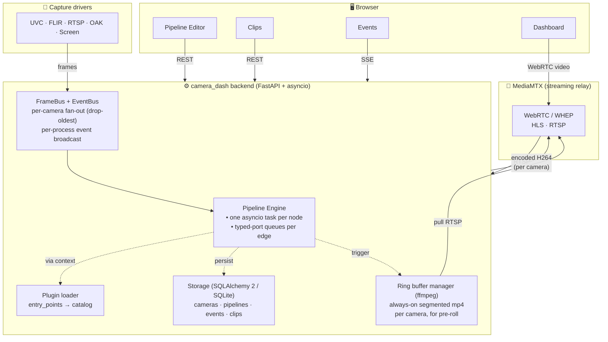
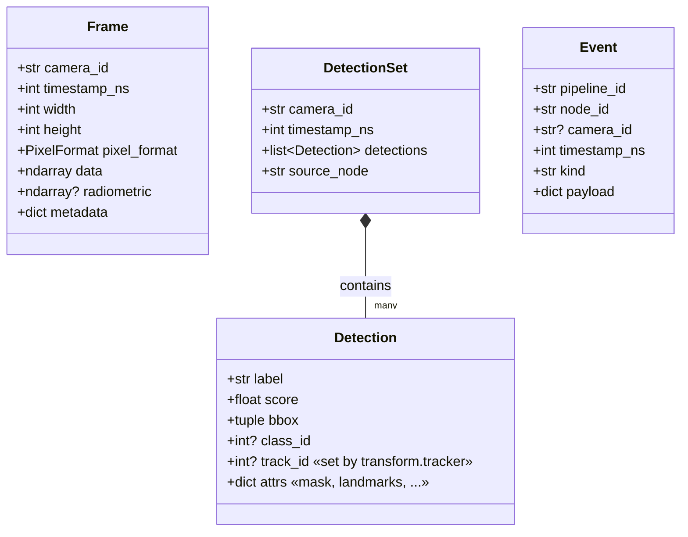
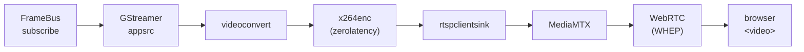

# camera_dash — Architecture

A complete description of how the system is put together: process boundaries, data flow, design choices, and code layout.

## 1. High-level



Three OS processes: **MediaMTX**, the Python **backend** (uvicorn), and the Vite **frontend** dev server (in production this becomes a static bundle served by nginx).

## 2. Data types



`Frame` for video, `DetectionSet` for per-frame model outputs, `Event` for "something happened" payloads going to sinks.

## 3. Pipeline engine

Source: `backend/camera_dash/pipeline/`

A pipeline is a DAG of nodes. The engine:
1. **Validates** the graph against the loaded catalog (`Graph.validate`):
   - unknown node types → reject
   - dangling edges → reject
   - port-type mismatch → reject (special-case: a DETECTIONS source can feed an EVENT sink, so condition outputs can drive sinks directly)
   - cycles → reject (DFS coloring)
2. **Builds queues** — one asyncio.Queue per edge, depth chosen by the source port's type:
   - `FRAME`: depth 2, drop-oldest (capture must never stall on a slow detector)
   - `DETECTIONS`: depth 4, drop-oldest
   - `EVENT`/`TRIGGER`: depth 256, keep-all (alerts must not be dropped)
3. **Spawns one asyncio task per node**.
4. **Cancels them all** on stop and runs each node's `teardown()`.

### Node base class

```python
class Node:
    INPUTS: tuple[Port, ...]
    OUTPUTS: tuple[Port, ...]
    CONFIG_SCHEMA: dict   # JSON Schema, rendered as a form in the editor
    UI_CATEGORY: str      # source | detector | transform | condition | sink

    async def setup(self): pass
    async def teardown(self): pass

    # Two implementation styles:
    #   (a) stateless: override process(**inputs) -> dict[port, value]
    #   (b) full control: override run(inbox, outbox)
```

Most detectors/transforms are stateless and use `process`. Sources, sinks, throttles, and trackers override `run` because they don't fit the one-in-one-out shape.

### Engine context

Each node gets a `NodeContext`:

```python
NodeContext(
    pipeline_id,
    settings,        # global config
    camera_manager,  # to inspect cameras
    frame_bus,       # to subscribe/publish frames (source.camera, sink.stream)
    event_bus,       # to broadcast events to /api/events/stream
    streaming,       # to attach RTSP publishers (sink.stream)
    derived_streams, # to register derived stream tiles (sink.stream)
    ring_buffers,    # to acquire pre-roll segments (sink.recorder)
)
```

This means nodes don't import services directly — they pull them from context. Easy to mock for tests.

## 4. Plugin system

The catalog is built at startup by reading two Python entry-point groups:

```toml
[project.entry-points."camera_dash.nodes"]
"detector.yolo" = "camera_dash.pipeline.nodes.detectors.yolo:YoloDetectorNode"
# … 28 more

[project.entry-points."camera_dash.sinks"]
"sink.mqtt" = "camera_dash.pipeline.nodes.sinks.mqtt:MqttSink"
# … 10 more
```

External packages can add nodes by declaring entry-points in their own `pyproject.toml`. After `pip install` they show up in the editor palette automatically. See `examples/plugins/camera_dash_demo_sink/` for a template.

## 5. Streaming

### Capture → frame bus

Each camera driver (`cameras/{uvc,flir_lepton,rtsp,screen,oak}.py`) runs a GStreamer pipeline (or, for OAK, the DepthAI SDK) and publishes BGR frames to the **FrameBus**:

```python
frame_bus.publish_nowait(camera_id, Frame(...))
```

The FrameBus is a per-camera-id fan-out of asyncio.Queue subscribers with **drop-oldest** semantics — so a slow consumer (e.g. a slow detector) can never stall capture or starve other consumers. It also tracks publish timestamps so `/api/stats` can report rolling fps.

### Frame bus → browser (WebRTC)

For each running camera, the `StreamingManager` attaches a `StreamPublisher`:



MediaMTX handles the WebRTC handshake; the browser hits `http://mediamtx:8889/camera/<id>/whep` with an SDP offer and gets back an answer.

Derived streams (from `sink.stream`) follow the same path under the id `derived/<pipeline>/<node>`.

### Frame bus → pipelines

`source.camera` is a Node that subscribes to the FrameBus and emits each frame on its single `frame` output port. Multiple pipelines can subscribe to the same camera independently.

## 6. Events & SSE

The **EventBus** is a process-local fan-out for `Event` objects. Condition and sink nodes publish into it; the `/api/events/stream` SSE endpoint subscribes and pushes each event to all connected browsers.

This is how the dashboard's Log/Alert/Timeline tiles get their data without polling the database.

## 7. Persistence

SQLAlchemy 2.0 async + aiosqlite by default. Models in `storage/models.py`:

| Table | Stores |
|---|---|
| `cameras` | camera specs (id, kind, label, params, enabled) |
| `pipelines` | pipeline JSON definitions + enabled flag |
| `events` | every pipeline Event (`sink.sqlite` writes these) |
| `clips` | mp4 recordings + snapshots (path, started_at, ended_at, trigger) |

The DSN comes from the active config file's `storage.dsn`. **Relative paths are resolved relative to the config file's parent directory** so the DB doesn't follow the user's CWD around (this was a real bug we hit).

Postgres swap-in is supported: change the DSN to `postgresql+asyncpg://…`.

## 8. Recording (pre-roll ring buffer)

`recording/ring_buffer.py` runs an always-on `ffmpeg` per camera that pulls from MediaMTX RTSP and writes segmented `.ts` files in a wrap configuration. When `sink.recorder` fires, `recording/writer.py`:
1. picks the N most recent segments (covers `pre_roll_s` seconds)
2. fires off a separate ffmpeg pulling `post_roll_s` seconds of live RTSP
3. concatenates them via ffmpeg's concat demuxer
4. extracts a JPEG thumbnail from the result
5. persists a `Clip` row

`RingBufferManager` is reference-counted so two recorder nodes targeting the same camera share one ring (no duplicate ffmpeg processes).

## 9. REST + WebSocket surface

See [`API.md`](API.md) for the full reference. Quick map:

```
/api/cameras          list, add, remove, rename, discover
/api/pipelines        CRUD + start/stop + runtime status
/api/streams          list derived streams
/api/snapshots/{id}   POST → capture, GET → serve
/api/clips            list, serve mp4, serve JPG thumb, delete
/api/events           historical query + /stream (SSE live tail)
/api/radiometric/{id} WebSocket → 16-bit thermal matrix per frame
/api/stats            per-camera fps + pipeline status snapshot
/api/templates        4 built-in pipeline templates
/api/draft            POST a prompt → Claude returns pipeline JSON
/api/plugins          node catalog (for editor palette)
```

## 10. MCP server

`backend/camera_dash/mcp_server.py` wraps the REST API as FastMCP tools (13 tools). Stdio transport. Runs out-of-process so it can be invoked from Claude Code / Claude Desktop without sharing the backend's event loop.

## 11. Frontend

React 18 + Vite + TypeScript + Tailwind 4. Key components:

```
src/
  App.tsx                      router (Dashboard / Pipelines / Cameras / Clips / Events)
  api/client.ts                typed REST + SSE + WS clients (one file, ~150 lines)
  dashboard/
    Dashboard.tsx              tile canvas (free positioning via react-rnd)
    CameraTile.tsx             WebRTC <video> + zoom + snapshot + polygon button
    FlirOverlay.tsx            thermal hover-temp via radiometric WS
    PolygonEditor.tsx          modal zone editor with click-to-add-points
    LogTile.tsx                SSE-fed event console with filters
    AlertTile.tsx              flashing/audible alerts
    StatsTile.tsx              live fps + pipeline status
    TimelineTile.tsx           color stripe per pipeline
  editor/
    PipelineEditor.tsx         React Flow canvas + sidebar + AI/template buttons
    NodePalette.tsx            grouped catalog from /api/plugins
    PropertiesPanel.tsx        rjsf form for selected node's config
    nodes/PipelineNode.tsx     custom React Flow node component
  cameras/CameraManager.tsx    add/remove cameras
  clips/ClipsBrowser.tsx       grid + list views, inline mp4 player
  events/EventStream.tsx       dev view of live + historical events
```

## 12. Design choices worth knowing

| Choice | Reason |
|---|---|
| asyncio queues for pipeline edges | Backpressure built-in; drop-oldest semantics map cleanly to "live video" |
| One ffmpeg per camera for ring buffer | Smallest moving parts; concat-demuxer rather than re-encode for pre-roll |
| MediaMTX for streaming | Battle-tested; WebRTC out of the box; ingest from a single RTSP push works |
| GStreamer for capture (not OpenCV) | Better device control; tee branches; works for both UVC and FLIR Y16 |
| FrameBus latest-wins | Detection at 5fps shouldn't block 30fps capture; old frames are uninteresting anyway |
| Entry-points for plugins | Standard Python mechanism; `pip install` makes nodes appear |
| JSON-as-truth for pipelines | Editor reads/writes JSON; no separate parser. Same JSON ships to mac/rpi/dgx (with `${profile.X}` substitution). |
| Sinks accept DETECTIONS into EVENT ports | Eliminates a "wrap detections in event" step that adds nothing |
| Native wheel handler in CameraTile | React's synthetic `onWheel` is passive — `preventDefault` doesn't work |
| Brew Python (not python.org) on macOS | python.org's Python.app launcher strips `DYLD_FALLBACK_LIBRARY_PATH`, breaking PyGObject's GLib load |
| react-rnd over react-grid-layout for tile positioning | Free positioning matches the "throw tiles around" UX; library doesn't fight flexbox |

## 13. Code layout

```
camera_dash/
├── backend/
│   ├── pyproject.toml            deps + entry-points
│   ├── camera_dash/
│   │   ├── __init__.py
│   │   ├── main.py               FastAPI app + lifespan wiring
│   │   ├── settings.py           pydantic-settings, resolves paths
│   │   ├── cli.py                Click entry: run / validate / mcp
│   │   ├── plugins.py            entry-point loader
│   │   ├── mcp_server.py         FastMCP wrapper of the REST API
│   │   ├── api/                  HTTP routers
│   │   │   ├── cameras.py        clips.py  draft.py  events.py
│   │   │   ├── pipelines.py      plugins.py  radiometric.py
│   │   │   ├── snapshots.py      stats.py  streams.py  templates.py
│   │   ├── cameras/
│   │   │   ├── base.py           Camera ABC
│   │   │   ├── manager.py        CameraManager (registry + DB)
│   │   │   ├── uvc.py  flir_lepton.py  rtsp.py  screen.py  oak.py
│   │   ├── streaming/
│   │   │   ├── frame_bus.py      per-camera fan-out + fps tracking
│   │   │   ├── event_bus.py      per-process event fan-out
│   │   │   ├── gst.py            StreamPublisher + StreamingManager
│   │   │   ├── mediamtx.py       URL helpers + health
│   │   │   ├── registry.py       DerivedStreamRegistry
│   │   ├── pipeline/
│   │   │   ├── types.py          Frame, Detection, Event, PortType
│   │   │   ├── node.py           Node ABC, Inbox, Outbox, NodeContext
│   │   │   ├── graph.py          Graph + validate + cycle check
│   │   │   ├── engine.py         PipelineEngine + _RunningPipeline
│   │   │   ├── nodes/
│   │   │   │   ├── sources.py    camera, file
│   │   │   │   ├── detectors/    yolo, yolo_world, onnx, opencv_dnn,
│   │   │   │   │                 mediapipe_face, mog2, optical_flow,
│   │   │   │   │                 vision_llm, pose, segmentation, ocr, anomaly
│   │   │   │   ├── transforms/   resize, crop, colormap, annotate,
│   │   │   │   │                 throttle, tracker, privacy_mask
│   │   │   │   ├── conditions/   metadata_match, temperature_gate, zone,
│   │   │   │   │                 counter, line_crossing, schedule, cooldown
│   │   │   │   └── sinks/        mqtt, kafka, webhook, recorder, sqlite_event,
│   │   │   │                     console, stream, telegram, ntfy, pushover, email
│   │   ├── recording/
│   │   │   ├── ring_buffer.py    always-on segmented recorder per camera
│   │   │   └── writer.py         concat + thumbnail
│   │   ├── storage/
│   │   │   ├── db.py             async engine + sessionmaker
│   │   │   └── models.py         Camera, Pipeline, Event, Clip
│   │   └── utils/
│   │       └── radiometric.py    centi-Kelvin ↔ Celsius, colormap, downsample
│   └── tests/                    pytest (13 tests, no hardware needed)
├── frontend/                     React + Vite + TS + Tailwind
├── mediamtx/mediamtx.yml         streaming relay config
├── configs/                      deploy.{mac,rpi,dgx}.yml
├── examples/
│   ├── pipelines/                4 example JSONs
│   └── plugins/camera_dash_demo_sink/   external plugin example
├── scripts/
│   ├── install-macos.sh  install-linux.sh  run.sh  dev-setup.sh
└── docs/
    ├── USER_MANUAL.md  ARCHITECTURE.md  NODES.md  API.md
    └── INSTALLATION.md  TROUBLESHOOTING.md  DEVELOPMENT.md
```
