# camera_dash — Pipeline Examples

The `examples/pipelines/` directory ships **17 ready-to-install pipelines** covering common use cases. Each one has a `.json` definition plus a `.meta.json` sidecar with description, tags, complexity, and required env vars.

## Installing examples

Three ways, in increasing order of automation:

### 1. The browser (easiest)

Navigate to the **Examples** tab in the dashboard (http://localhost:5173/examples). You get a grid of cards with descriptions and tags. Click **Install →** on any card; if the example has `REPLACE_ME` placeholder camera IDs, a dialog asks you to map them to real cameras, then drops you into the editor with the new pipeline loaded.

### 2. The CLI

```bash
# Install a specific example, mapping the placeholder to a real camera
camera_dash install-pipeline home_intrusion --map REPLACE_ME=front_door

# Install + start immediately
camera_dash install-pipeline pet_door_camera --map REPLACE_ME=mudroom --enable

# Install all 17 at once (placeholders left as REPLACE_ME — must be fixed before starting)
camera_dash install-pipeline --all

# Install from a local JSON file (not an example id)
camera_dash install-pipeline ./my_custom_pipeline.json --enable
```

### 3. The REST API

```bash
# List
curl http://localhost:8001/api/examples

# Install
curl -X POST http://localhost:8001/api/examples/home_intrusion/install \
  -H "content-type: application/json" \
  -d '{"camera_map":{"REPLACE_ME":"front_door"}, "target_id":"my_intrusion", "enabled":true}'
```

The MCP server also exposes `install_example` so Claude can install examples for you.

---

## The examples

Sorted by complexity. Use them as starting points — once installed, edit freely.

### Simple

#### `home_intrusion` — Home intrusion alert

Person on camera → 30s clip (with 5s pre-roll) → ntfy push. Debounced 90s.

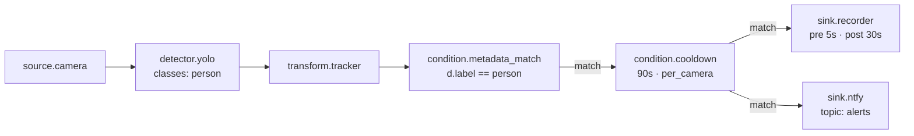

#### `pet_door_camera` — Pet door log + clip

Dog or cat appears → log + 15s clip. Debounced 30s per (camera, class).

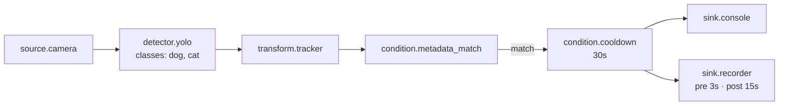

#### `driveway_arrival` — Driveway arrival

Vehicle on camera → push + 30s clip. 2-minute cooldown.

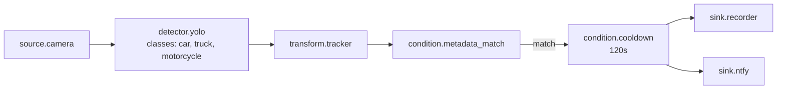

#### `office_occupancy` — Office occupancy counter

Counts visible people every 60s; pushes to MQTT when >= 5 are seen.

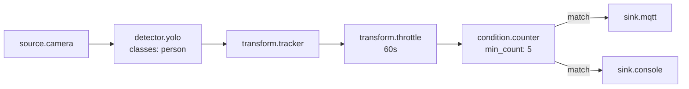

#### `motion_with_annotation` — Motion blobs (no ML)

MOG2 background subtraction; annotated stream + throttled log. Runs on FLIR thermal too.

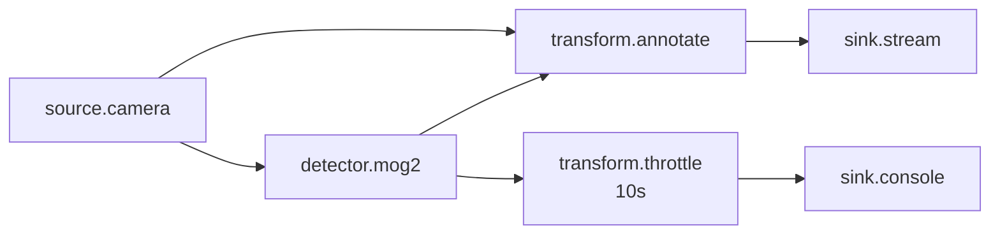

#### `privacy_face_blur` — Privacy face blur

Detect faces (MediaPipe) → pixelate each → publish as derived stream. Source stays unblurred.

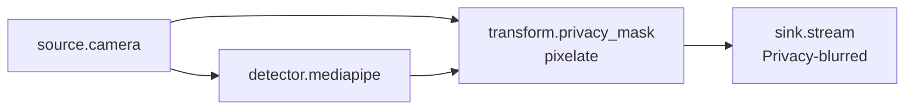

#### `person_detection_mqtt` — Person detection → MQTT (basic)

Smoke-test / starter template; YOLO person → MQTT + SQLite event log.

#### `laptop_detect_log` — Annotated webcam stream

Visible-light parallel to the FLIR thermal demo; useful for comparison.

#### `thermal_alert` — Thermal hotspot → MQTT + clip

FLIR-only; any pixel exceeds 60°C → MQTT push + 30s clip.

### Medium

#### `night_perimeter` — Zone + schedule + Pushover

Person enters polygon zone, but only between 21:00 and 06:00 → emergency-priority Pushover + clip.

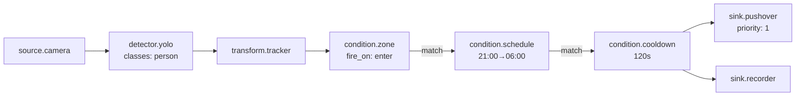

#### `package_delivery` — Porch dwell → Telegram

Person dwells in porch polygon for 3+ seconds → Telegram + clip. (Lingering driver, not someone walking past.)

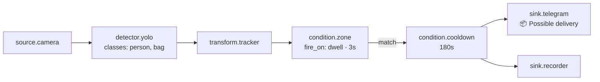

#### `vehicle_line_counting` — Counter to Kafka + SQLite

Tracked vehicles crossing a horizontal line → event per vehicle to Kafka and the events table.

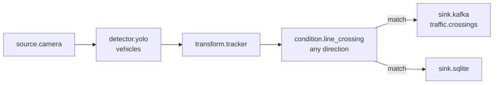

#### `fall_detection` — Pose heuristic → emergency push

MediaPipe pose + 'shoulder-to-ankle horizontal' heuristic → label `pose:fallen` → Pushover priority 2 (emergency).

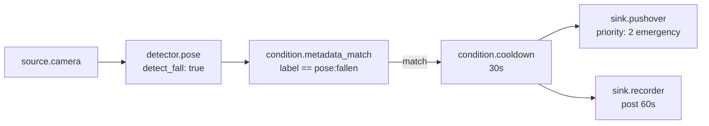

#### `wildlife_camera` — Open-vocab + annotated stream

YOLO-World prompted with `deer, bird, raccoon, fox, rabbit, squirrel, coyote` → annotated stream tile + record on hit.

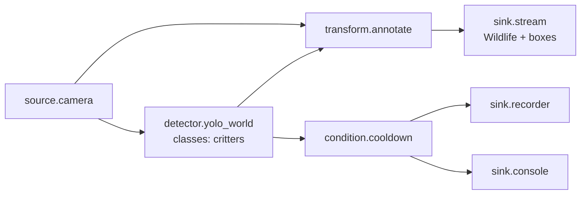

#### `flir_person_log` — FLIR + YOLO demo

Runs YOLO on the colormapped FLIR thermal frames (yes, this actually works — the inferno colormap is enough silhouette for YOLO to fire on people).

#### `multi_camera_branch` — Two cameras → two reactions

Demonstrates that a pipeline can have multiple sources and independent chains in one definition.

### Advanced

#### `vision_llm_doorbell` — Claude describes who's at the door

Person at the door → Claude looks at the frame → sentence-long description ("a UPS driver carrying a small package") → Telegram.

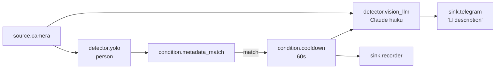

Requires `ANTHROPIC_API_KEY` + Telegram setup.

#### `license_plate_capture` — YOLO → OCR → SQLite + annotated stream

YOLO finds cars; EasyOCR runs inside each car bbox; results into SQLite and the annotated stream.

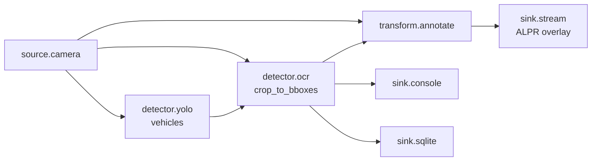

EasyOCR's first run downloads ~600MB. Not ALPR-grade but reads many plates legibly.

#### `ppe_compliance` — Set-level matcher

YOLO-World on `person`, `hard hat`, `safety vest`. The matcher uses set-level boolean: `any(x.label == 'person' for x in dets) and not any(x.label == 'hard hat' for x in dets)`.

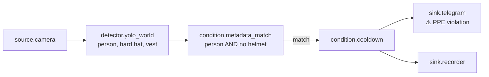

#### `scorpion_watch` — Open-vocab demo

YOLO-World prompted with `scorpion, dog, drone`. Quick way to experiment with open-vocab detection.

---

## Customising an example

After install, the example is a normal pipeline — open it in **Pipelines** and edit nodes freely. Common tweaks:

- **Change camera**: edit the `source.camera` node's `camera_id`
- **Different model**: swap `yolov8n.pt` → `yolov8m.pt` / `yolov8x.pt` (larger = slower but better)
- **Different classes**: edit the `classes` array on detector nodes
- **Polygon zone**: use the **▱** button on a camera tile to draw a polygon, copy the coords, paste into the `condition.zone` node's `polygon` field
- **Different sink**: drag-and-drop a different sink node in the editor, re-wire the edge
- **Save your variant** under a different `id` so you can tweak without losing the original

## Building your own example

If you have a pipeline you'd want to ship as a reusable example:

1. Save it via the editor (or write JSON by hand)
2. Drop the `.json` file into `examples/pipelines/`
3. Add a `<name>.meta.json` sidecar with `name`, `description`, `use_case`, `tags`, `complexity`, `requires_env`, `placeholders`
4. Restart the backend — it'll show up in `/api/examples` and the gallery automatically

The meta sidecar fields:

```json
{
  "name": "Human-friendly name",
  "description": "1-2 sentences for the card",
  "use_case": "Longer explanation (when to use, what it demonstrates)",
  "tags": ["home", "intrusion", "alerts"],
  "complexity": "simple | medium | advanced",
  "requires_env": ["ANTHROPIC_API_KEY"],
  "placeholders": ["REPLACE_ME"]
}
```

`placeholders` auto-populates from any `REPLACE_ME` strings in `camera_id` fields if you omit it.
